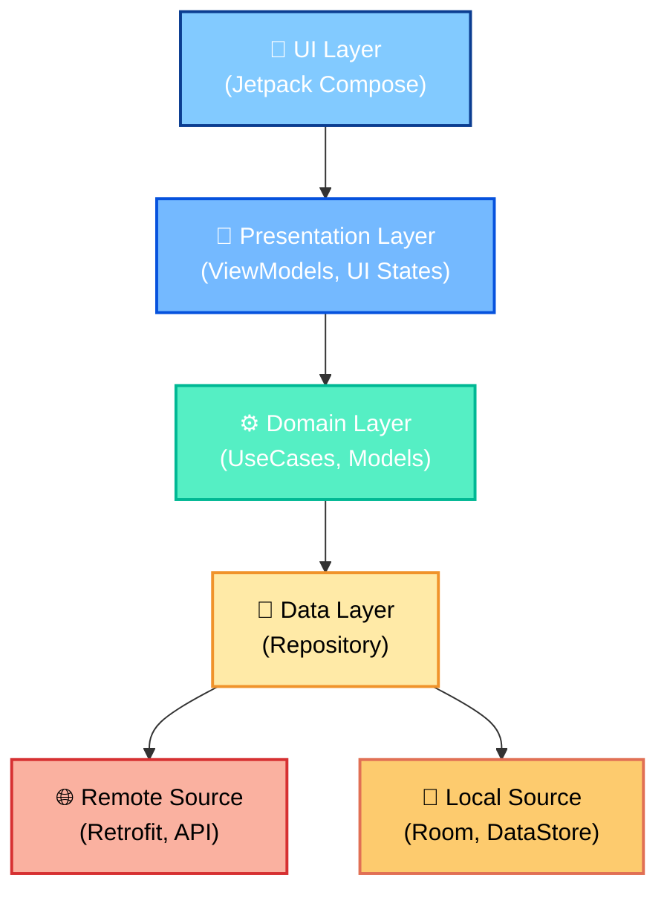
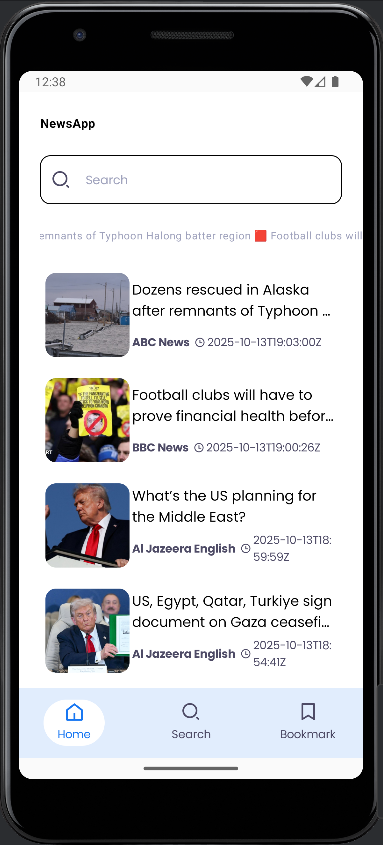
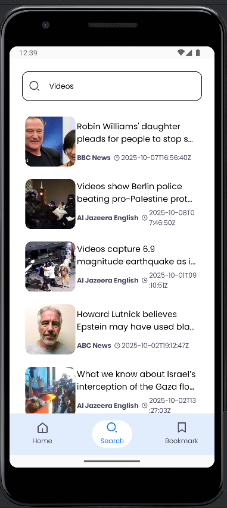
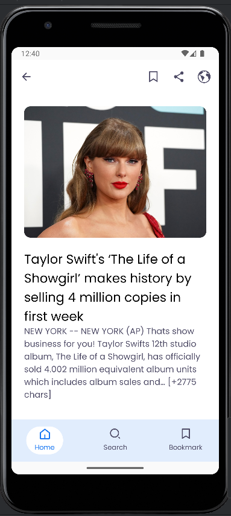
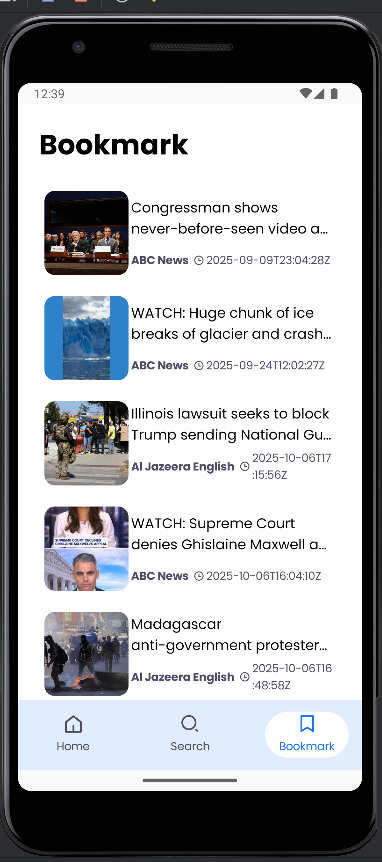
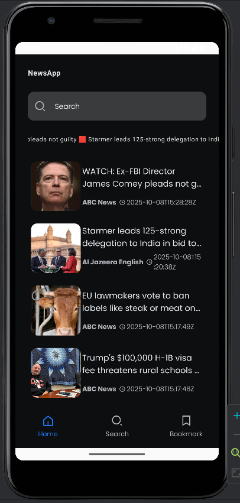
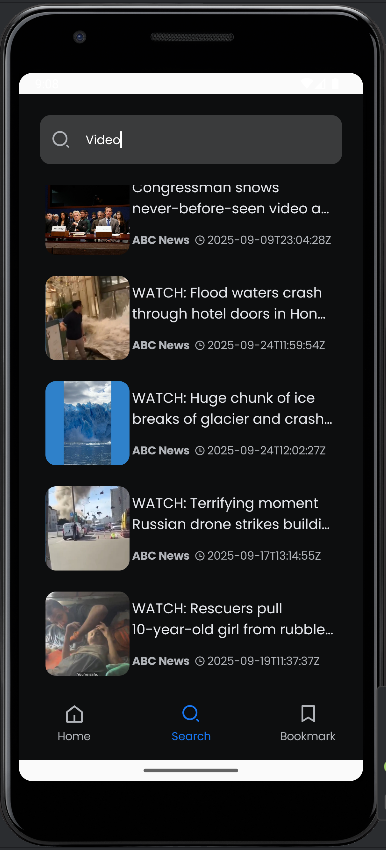
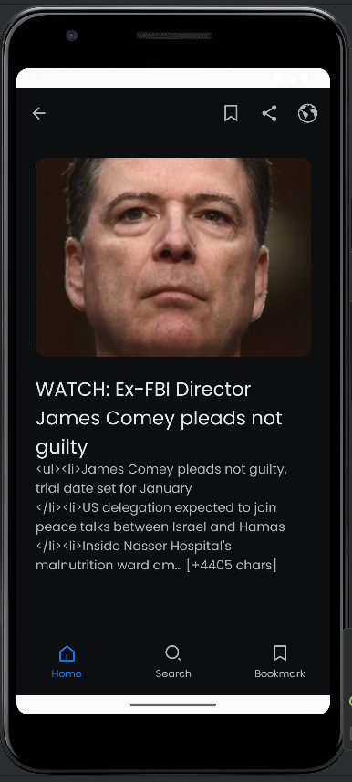
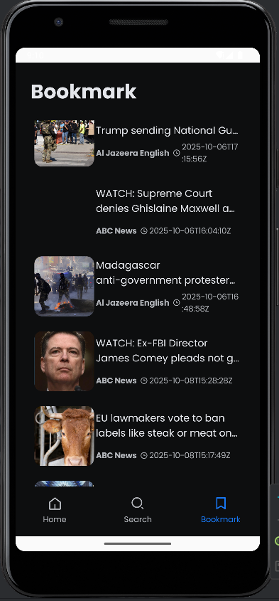

# 🗞️ NewsApp — Modern Clean Architecture Android App


> 📰 **NewsApp** is a fully functional, offline-capable Android news reader built using **Jetpack Compose**, **MVVM**, and **Clean Architecture**.  
> It integrates **Retrofit**, **Room**, and **Hilt**, offering a modular, testable, and scalable project setup.

<br>

## 🚀 Features

- 🧠 **Clean Architecture (Data–Domain–Presentation)**  
- 📲 **Jetpack Compose UI** with Material 3  
- 🌐 **News API integration** using Retrofit  
- 💾 **Offline caching** with Room database  
- 🔍 **Search news articles** by title or keyword  
- 🧭 **Modular Navigation** with Compose NavHost  
- 🌗 **Dark/Light theme support**  
- 🔐 **Serializable models** for navigation safety  

<br>

## 🧩 Tech Stack
1. ***`Language`:*** Kotlin
2. ***`Architecture`:*** Clean Architecture + MVVM
3. ***`UI`:*** Jetpack Compose, Material 3
4. ***`Network`:*** Retrofit, OkHttp Interceptors
5. ***`Database`:*** Room
6. ***`Dependency Injection (DI)`:*** Hilt
7. ***`Image Loading`:*** Coil
8. ***`Serialization`:*** Kotlinx Serialization

<br>

## 🗂️ Project Structure
```markdown
com.gyarsilalsolabki011.newsapp/
│
├── data/
│ ├── local/                   # Room DB, DAOs, Entities
│ ├── manager/                 # Manager Implementations
│ ├── remote/                  # API, DTOs, Interceptors, Pagination
│ └── repository/              # Repository implementations
│
├── di/                        # Hilt/Koin dependency injection modules
│
├── domain/
│ ├── manager/                 # DataStore or Preference Manager
│ ├── models/                  # Core models (Article, Source)
│ ├── repository/              # Repository interfaces
│ └── usecases/                # Use case classes (app_entry, news)
│
├── presentation/
│ ├── bookmark/                # Bookmark screen
│ ├── common/                  # Shared composables
│ ├── details/                 # Article details screen
│ ├── home/                    # Home and headlines UI
│ ├── mainActivity/            # Main launcher activity
│ ├── navigation/              # App navigation graph
│ ├── news_navigation/         # News-specific navigation
│ ├── onboarding/              # Onboarding flow
│ ├── search/                  # Search screen
│ └── Dimens/                  # Spacing, dimensions
│
├── ui.theme/                  # Colors, Typography, Shapes
├── utils/                     # Extensions, constants, helpers
└── NewsApp.kt                 # Application entry point
```

<br>

## ⚙️ Setup

1. **Clone the repository**
   ```bash
   git clone https://github.com/gyarsilalsolanki011/NewsApp.git
   ```
2. Add API key
   - Obtain an API key from https://newsapi.org
   - Place it in your local.properties or constants file:
   ```kotlin
   const val API_KEY = "YOUR_API_KEY"
   ```
3. Build & Run
   - Open in Android Studio (Arctic Fox or later)
   - Click ▶️ Run

<br>

## 🧠 Architecture Overview



<br>

## 📸 Screenshots 

## 📱 App Screenshots

| Home Screen                           | Search Screen                             | Article Details                             | Saved Articles                          |
|---------------------------------------|-------------------------------------------|---------------------------------------------|-----------------------------------------|
|       |       |       |       |
|  |  |  |  |


> [!NOTE]
> *(will add app screenshots here)* 

<br>

## 📜 License

This project is licensed under the [`MIT-License`](LICENSE) License.

<br>

## 👨‍💻 Developer  
**`Gyarsilal Solanki`**

[](https://www.linkedin.com/in/gyarsilal-solanki)  🤝  [](https://github.com/gyarsilalsolanki011)

  
**`Need Help!`**, Join us: 

[](https://github.com/eleven-dev-cafe/cafe-talks/discussions)   

---

***If you find this project helpful, consider giving it a ⭐ to support!***

